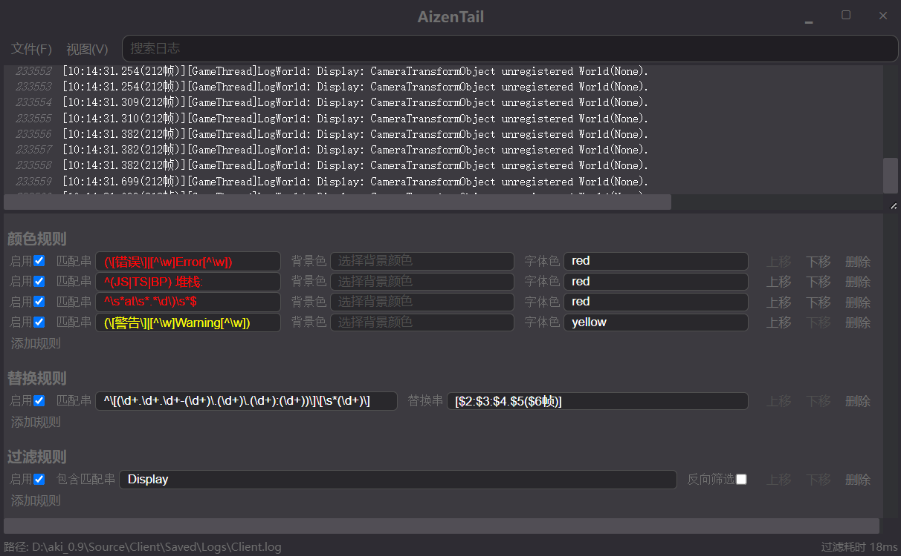

# 实时日志查看器

## 简介

提供日志的实时查看、染色及筛选功能。



## todo list
- 修改规则面板实现方式
  1. 避免修改单条规则时整个规则面板一起刷新
- 在正在进行筛选时增加一个等待界面，避免重复操作
- 替换规则不应该影响染色
- 把加载规则和另存规则修改为单独加载/另存一个规则集
- 考虑重新加回单独染色的功能
- 考虑“仅染色匹配部分”的功能
- 添加日志上限限制
- 多语言支持
- 减少内存占用
- 整理代码结构

## Recommended IDE Setup

- [VSCode](https://code.visualstudio.com/) + [ESLint](https://marketplace.visualstudio.com/items?itemName=dbaeumer.vscode-eslint) + [Prettier](https://marketplace.visualstudio.com/items?itemName=esbenp.prettier-vscode)

## Project Setup

### Install

```bash
$ npm install
```

### Development

```bash
$ npm run dev
```

### Build

```bash
# For windows
$ npm run build:win

# For macOS
$ npm run build:mac

# For Linux
$ npm run build:linux
```
